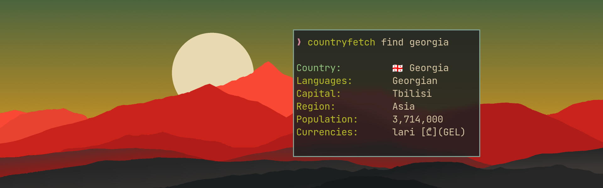

# countryfetch

**A cli tool for fetching information about countries. It uses https://restcountries.com/ API for backend.**



## Dependencies

[DENO](https://deno.land/)

## Installation

clone this repository:

```bash
git clone https://github.com/CondensedMilk7/countryfetch.git
```

navigate to the cloned repo folder and run install:

```bash
cd ./countryfetch
./install.sh
```

The app should now be installed.

alternatively, you can compile it yourself and store it in your local bin directory (might be safer):

```bash
deno compile --allow-all main.ts
cp ./countryfetch  ~/.local/bin
```

If after this your shell cannot find countryfetch, this means you haven't added your local bin to PATH. Either add it to PATH, or make an alias in your .bashrc or .zshrc:

```bash
alias countryfetch="~/.local/bin/countryfetch"
```

## Usage

```bash
countryfetch <arguments>
```

### Arguments:

- `<country_name>` - Find country information by name.
- `capital <capital>` - Find country to which the specified capital belongs.
- `sync` - Fetches data from API and stores it in `~/.cache/countryfetch/countries.json`. This is done automatically, but can be triggered manually.
  Pass additional argument `sync flag` to fetch and convert flags in ASCII art.
  After syncing flags, every countryfetch command will display flag ASCII art.
- `random` - Get random country information.
- `raw` - Print country information in raw format as JavaScript object.

### Example:

```
$ countryfetch germany

Country: Germany 🇩🇪
Lat/Lng: 51/9
Population: 83,240,525
Languages: German
Capital: Berlin
Capital Lat/Lng: 52.52/13.4
Region: Europe
Subregion: Western Europe
Timezones: UTC+01:00
Top Level Domain: .de
Currencies: Euro [€](EUR)
```

## Flag ASCII Art

[terminal_images](https://github.com/mjrlowe/terminal_images) library is used for image conversion. If you like my project, you should star
this project as well. Maybe contribute and help the author too!

To enable displaying ASCII art, run `countryfetch sync flags`. This may take a minute, depending on your network connection, as the
program fetches every flag image from countries data, converts them into ASCII art and stores them in "~/.cache/countryfetch/flags.json".
This library uses the unstable version of Deno, therefore if you get an error like "X is not a function" you should try passing the `--unstable` flag.
Due to this, consistency is not guaranteed.

If for some reason you no longer want to display ASCII art, simply delete the flags.json in cache:

```
rm ~/.cache/countryfetch/flags.json
```

## Troubleshooting

If you get an error after installing the newer version of the program, such as "cannot read properties of undefined",
you might have an outdated cache. Try running `countryfetch sync` to update the cache.

## Would be nice to have in the future (a bit ambitious):

- ~~Display country flag in ASCII format (like in neofetch).~~
- Better arguments and options passing/handling.
- Users can customize which information to display about country.
- Get only one particular property about country (for example, get just the timezone of Netherlands).
- Custom query builder that makes a direct call to api and returns a readable information.
- A capital guessing game.

## Contribution

I will add new features when I have time, but you don't have to wait - add them yourself! Submit pull requests, or fork it and make it your own alltogether.
