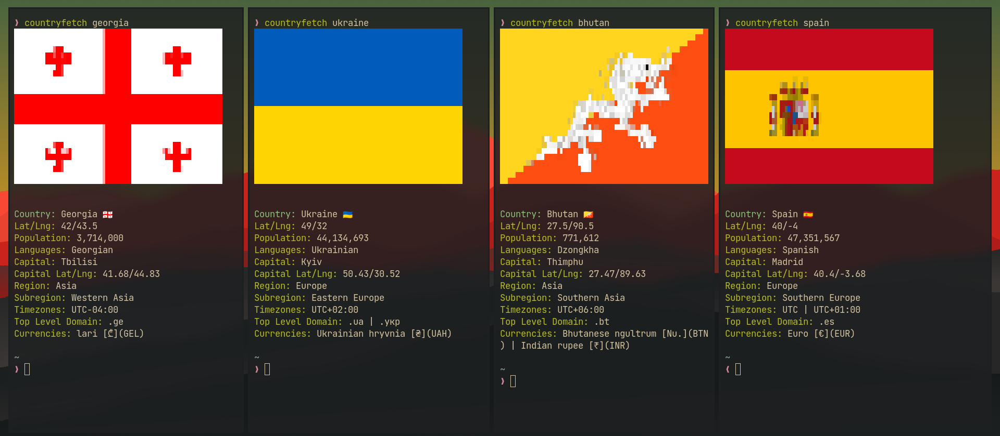

# countryfetch

A cli tool for fetching information about countries. It uses https://restcountries.com/ API for backend.



## Dependencies

[DENO](https://deno.land/)

## Installation

clone this repository:

```bash
git clone https://github.com/CondensedMilk7/countryfetch.git
```

navigate to the cloned repo folder and run install:

```bash
cd ./countryfetch
./install.sh
```

The app should now be installed.

alternatively, you can compile it yourself and store it in your local bin directory (might be safer):

```bash
deno compile --allow-all main.ts
cp ./countryfetch  ~/.local/bin
```

If after this your shell cannot find countryfetch, this means you haven't added your local bin to PATH. Either add it to PATH, or make an alias in your .bashrc or .zshrc:

```bash
alias countryfetch="~/.local/bin/countryfetch"
```

## Usage

```bash
countryfetch <arguments>
```

### Arguments:

- `<country_name>` - Find country information by name. Country names cannot have whitespaces, use kebab-case or snake_case instead.
- `capital <capital>` - Find country to which the specified capital belongs.
- `sync` - Fetches data from API and stores it in `~/.cache/countryfetch/countries.json`. This is done automatically, but can be triggered manually.
- `random` - Get random country information.

### Example:

```
$ countryfetch germany

# output:

Country:	Germany 🇩🇪
Languages:	German
Capital:	Berlin
Region:		Europe
Population:	83,240,525
Currencies:	Euro [€](EUR)

```

## Contribution

I will add new features when I have time, but you don't have to wait - add them yourself! Submit pull requests, or fork it and make it your own alltogether.
